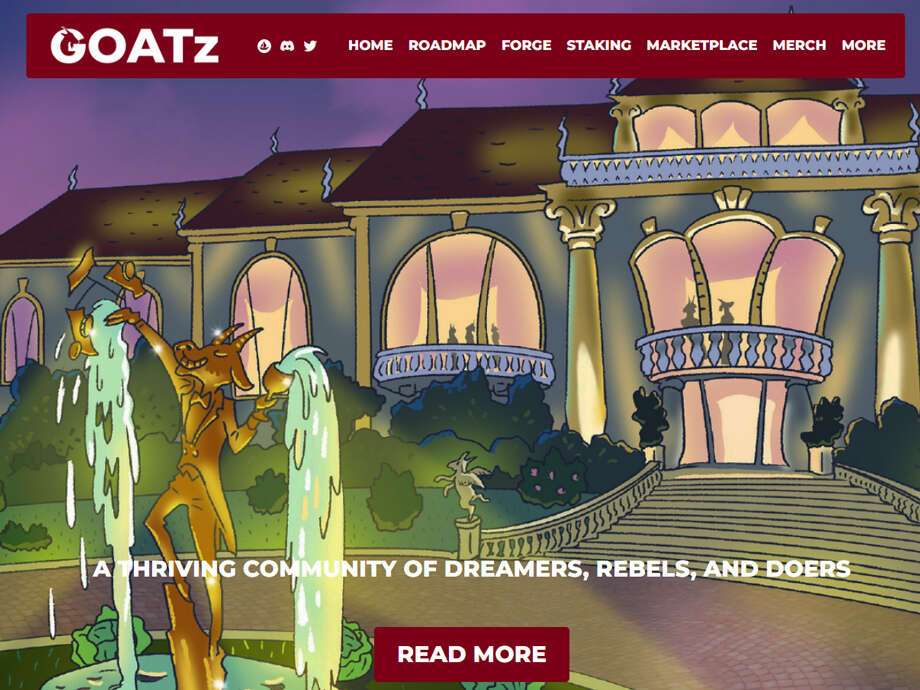

# GOATz KIDZ (New)

GOATz 于 2021 年 7 月推出，是有史以来第一个通货紧缩的 PFP NFT，它使所有者能够通过名为 The Forge 的流程自定义其 NFTS。GOATz 的稀缺性一直在增加，而艺术也在不断提高。拥有一只 GOAT 将打开通往令人惊叹的社区的大门，以及我们在沙盒和 NFT 世界等不同的虚拟世界中专门为 GOATz 开发的一切。

在 GOATz 宇宙中，KIDz 是长期收入者！通过质押我们的伙伴 NFT，KIDz，您将随着时间的推移赚取 $GMILK。$GMILK 是我们的游戏内货币，可用于在我们的生态系统内购买物品和体验。如果您有更多问题，请查看我们的白皮书。

创建 GOATz 的主要原因之一是赋予所有者控制权，并允许他们制作代表自己、故事或野心的 NFT！通过The Forge，这成为可能。拥有者可以取 2 只不同的 GOATz，并从每只 GOAT 中选择他们最喜欢的特征，以形成 1 只组合 GOAT。

