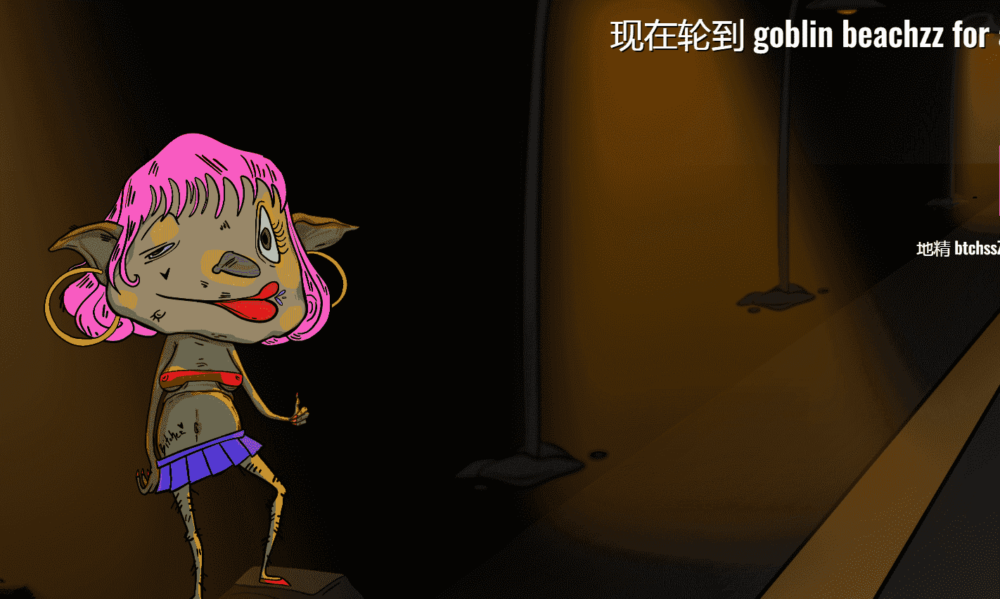

# Goblin Beaches

什么是地精 Btchz？
Goblin Btchz 是一个 NFT（Non-fungible token）集合。存储在区块链上的数字艺术品集合。

有多少个 Goblin Btchz 代币？
总共有 2,908 个 Goblin Btchz NFT。目前，1,652 名所有者的钱包中至少有一个 Goblin Btchz NTF。

最近卖了多少Goblin Btchz？
过去 30 天内售出了 24 个 Goblin Btchz NFT。

