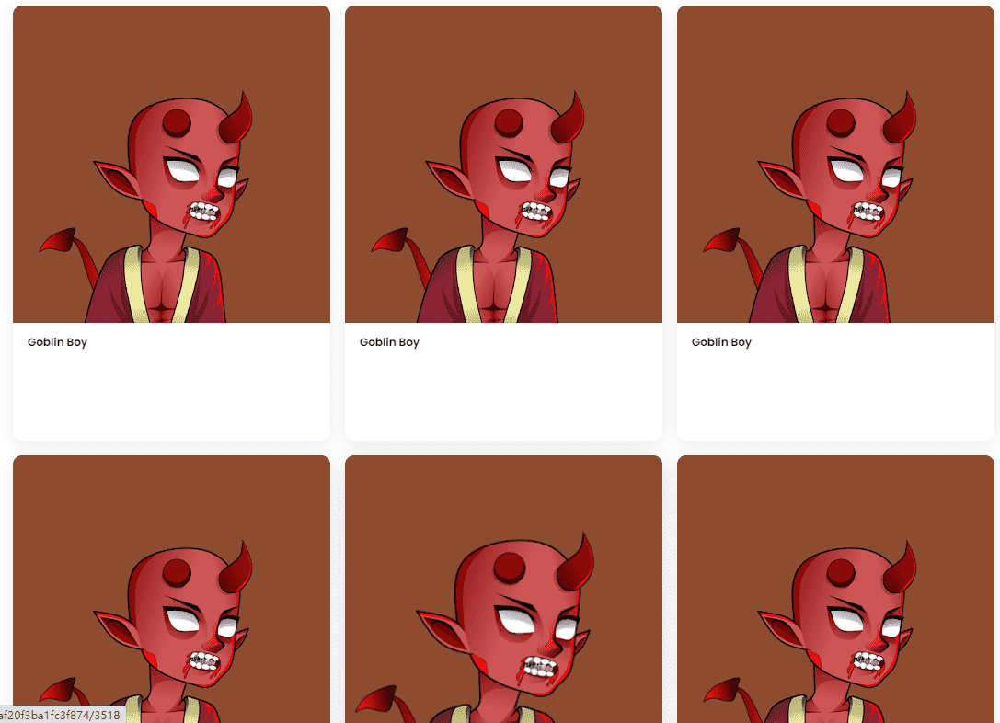

# Goblin Boys

Goblin Boys 是由 khronos 制作的原创且独特的 5,555 个头像系列。
Reveal at UTC 15:00 May 26, 2022，不要错过Twitter Space上的 Reveal Party。

▶ 什么是哥布林男孩？
Goblin Boys 是一个 NFT（非同质代币）系列。存储在区块链上的数字艺术品集合。
▶ 哥布林男孩代币有多少？
总共有 5,555 个 Goblin Boys NFT。目前，1,416 位车主的钱包中至少有一个 Goblin Boys NTF。
▶ 最近卖出了多少哥布林男孩？
过去 30 天内售出 0 个 Goblin Boys NFT。
▶ 什么是流行的 Goblin Boys 替代品？
许多拥有 Goblin Boys NFT 的用户还拥有 Okay Panda、 Ciphersquares Official、 Dead Ones-GEN 2和 Rice Courier NFT。
