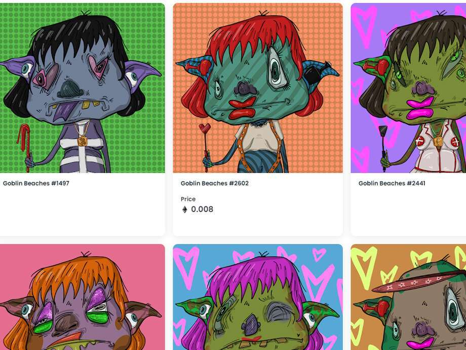

# goblin-btchz

##### ▶ 什么是 Goblin Btchz ？

Goblin Btchz 是一个 NFT（Non-fungible token）集合。存储在区块链上的数字艺术品集合。

##### ▶ 有多少个 Goblin Btchz 代币？

总共有 2,908 个 Goblin Btchz NFT。目前，1,652 名所有者的钱包中至少有一个 Goblin Btchz NTF。

##### ▶ 最昂贵的 Goblin Btchz 销售是什么？

售出的最昂贵的 Goblin Btchz NFT 是 Goblin Beaches #1556。它于 2022-06-06（3 个月前）以 18.1 美元的价格售出。

##### ▶ 最近卖了多少Goblin Btchz？

过去 30 天内售出了 24 个 Goblin Btchz NFT。

##### ▶ 一个地精 Btchz 多少钱？

过去 30 天，最便宜的 Goblin Btchz NFT 销售额低于 4 美元，最高销售额超过 18 美元。Goblin Btchz NFT 在过去 30 天内的中位价格为 9 美元。
