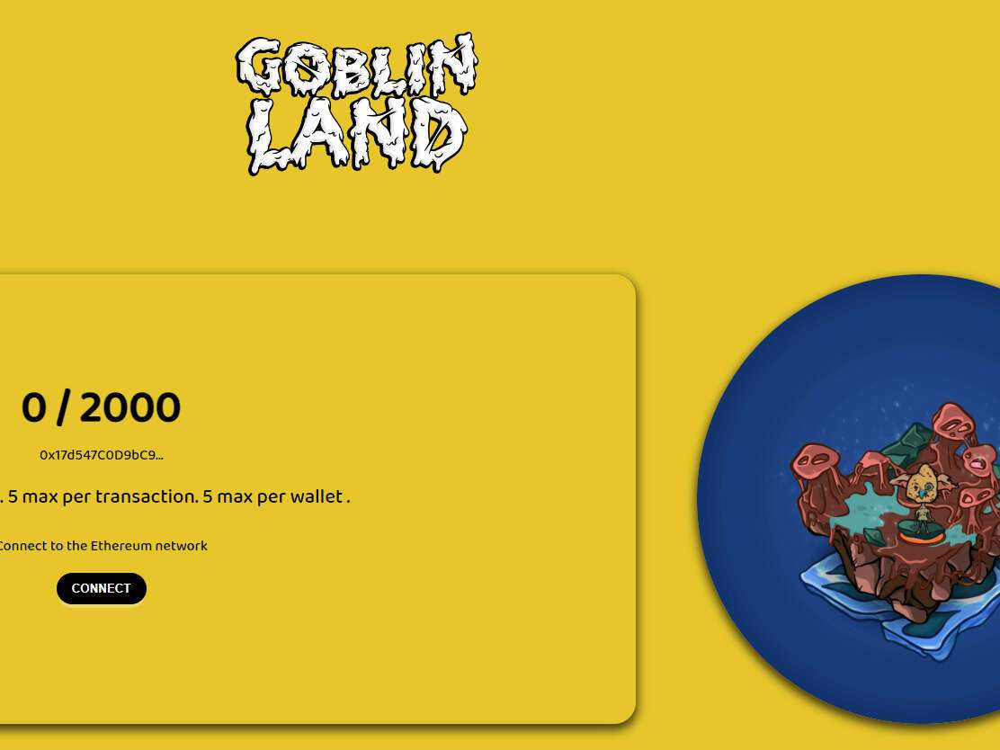

# Goblin Land NFT

Goblin Land 是 2,000 个怪诞地块的集合，是以太坊区块链上淘气的地精的家园。没有路线图，没有实用程序，只是纯粹的乐趣。据说这片土地非常适合地精和他们的女朋友——作为一个新家。不隶属于任何 Goblin 项目，包括 AUUUGHHH goblins DEJEN RATS yummz crawlybutt。于 2022 年 5 月 25 日首次铸造。

我们目前正在追踪流通中的 2,000 个 Goblin Land NFT 代币，这些代币尚未被销毁或质押。我们为 Goblin Land NFT 索引了 91 个独特的特征对。购买 Goblin Land NFT 最常见的地方包括 OpenSea 和 LooksRare 等市场或 Gem.xyz 和 Genie.xyz 等聚合器。链接可以在上面找到！
