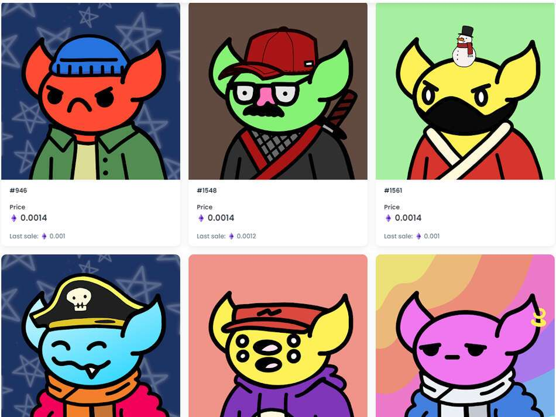

# Goblin Mob

Goblin Mob 是一个 NFT（非同质代币）集合。存储在区块链上的数字艺术品集合。一群 6,700 只地精。一个简单的 PFP 集合。没有团队 | 没有路线图 | 没有实用程序 | 只是艺术。

GoblinVault 拥有的所有未售出的地精将接受 0.001 ETH 或以上的报价。对于有多个出价的地精，将接受最高出价。要超过另一个买家，您必须比该买家至少出价 0.0001 ETH（例如，出价 = 0.001，您必须出价 0.0011 才能获胜，否则第一个出价者将获胜）。基本上，出价必须至少以 0.0001 ETH 为增量。

报价可能需要几天时间才能被接受。

如果他们说“内容不可用”，请单击刷新元数据。

总共有 1,950 个 Goblin Mob NFT。目前 527 位所有者的钱包中至少有一个 Goblin Mob NTF。

