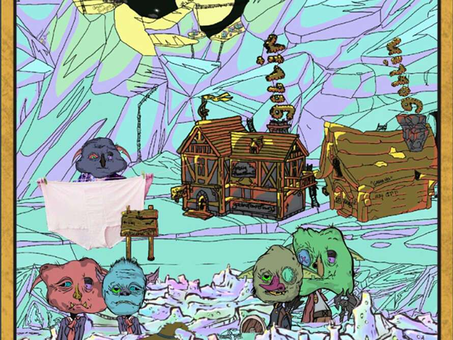

# goblintowntowns.wtf

##### ▶ 什么是 goblintowntowns.wtf？

goblintowntowns.wtf 是一个 NFT（非同质化代币）集合。存储在区块链上的数字艺术品集合。

##### ▶ 有多少 goblintowntowns.wtf 代币？

总共有 1,675 个 goblintowntowns.wtf NFT。目前 571 位所有者的钱包中至少有一个 goblintowntowns.wtf NTF。

##### ▶ goblintowntowns.wtf 最贵的交易是什么？

售出的最昂贵的 goblintowntowns.wtf NFT 是 Goblin Towns #1187。它于 2022-06-06（3 个月前）以 14.3 美元的价格售出。

##### ▶ 最近卖了多少 goblintowntowns.wtf？

过去 30 天内售出了 18 个 goblintowntowns.wtf NFT。

##### ▶ goblintowntowns.wtf 多少钱？

在过去 30 天里，最便宜的 goblintowntowns.wtf NFT 销售额低于 15 美元，最高销售额超过 26 美元。goblintowntowns.wtf NFT 在过去 30 天内的中位价格为 18 美元。
