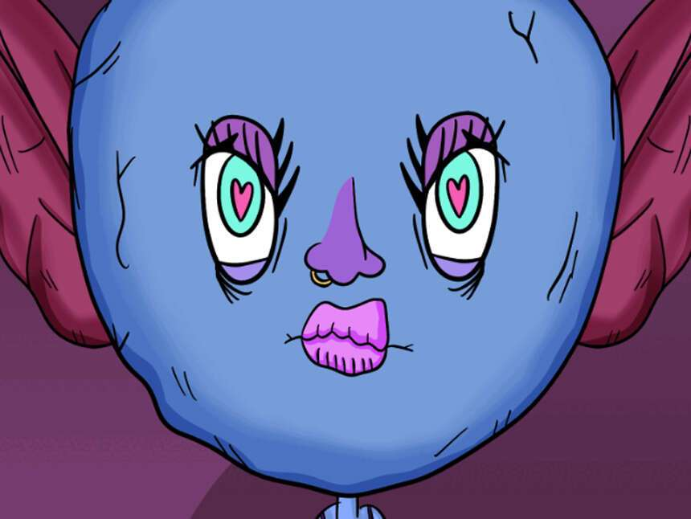

# GoblinWomen.wtf

GoblinWomen.wtf 于 2022 年 7 月 8 日首次铸造。灵感来自 GoblinTown + World Of Women | 每个 GoblinWomen NFT 1 GW = 0.001 ETH！我们的价格目标：每 Gw nft 1 ETH！我们将为我们的下一个项目提供免费薄荷糖。薄荷价格将很快上涨！我们就是这样来到这里的。没有路线图。没有不和谐。没有实用性。我们目前正在追踪流通中的 9,021 个 GoblinWomen.wtf 代币，这些代币尚未被销毁或质押。我们为 GoblinWomen.wtf 索引了 58 个独特的特征对。购买 GoblinWomen.wtf 的最常见地点包括 OpenSea 和 LooksRare 等市场或 Gem.xyz 和 Genie.xyz 等聚合器。链接可以在上面找到！

迄今为止，我们已在 OpenSea、LooksRare、Gem.xyz 和 Genie 中为 GoblinWomen.wtf 建立了**Ξ 1.31卷的索引。**基于**Ξ 0的底价和****9,021**的流通供应量，我们估计 GoblinWomen.wtf 的市值**为 3,929 美元**，Eth 价格**为 1,452 美元**。
