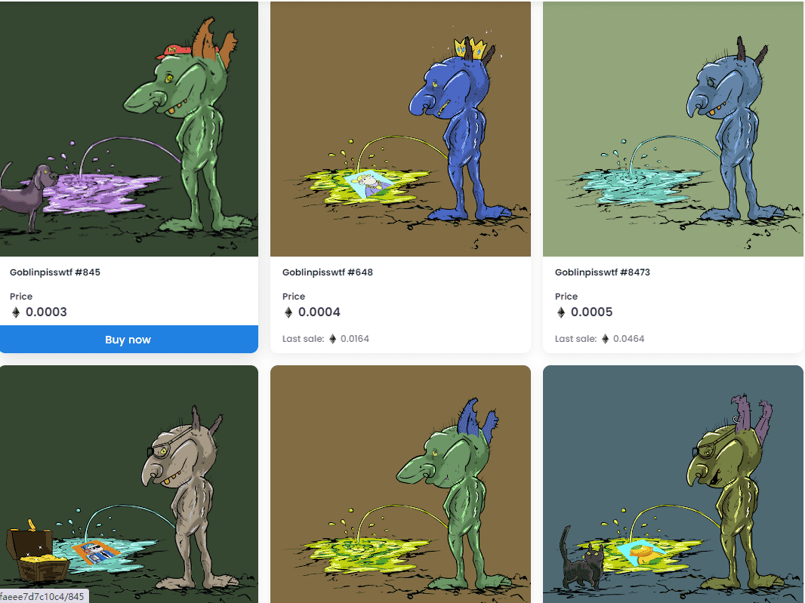

# goblinass.wtf

goblinpisswtf NFT 在过去 7 天内售出 17 次。goblinpisswtf 的总销售额为 11.86 美元。一个 goblinpisswtf NFT 的平均价格为 0.7 美元。共有 3,834 个 goblinpisswtf 所有者，拥有总供应量 9,998 个代币。售出的最昂贵的 goblinpisswtf NFT 是 Goblinpisswtf #6520。它于 2022 年 6 月 8 日（3 个月前）以 91 美元的价格售出。过去 30 天内售出了 307 个 goblinpisswtf NFT。在过去 30 天里，最便宜的 goblinpisswtf NFT 销售额低于 1 美元，最高销售额超过 9 美元。goblinpisswtf NFT 在过去 30 天内的中位价格为 4 美元。
