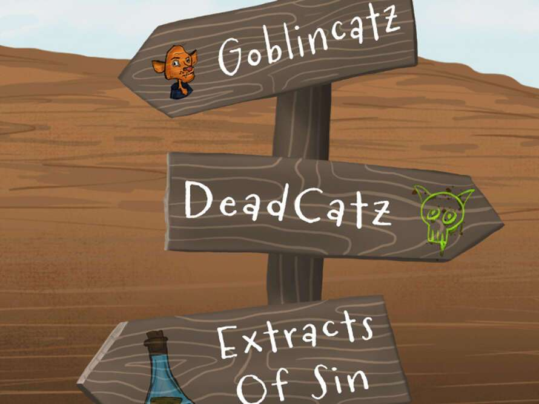

# Goblincatz

GoBliNcAtZ 将 RICHUR 合为一体 - Fat Catz 的衍生产品（刷新数据集）。Goblincatz 于 2022 年 6 月 10 日首次铸造。我们目前正在追踪流通中的 9,998 个 Goblincatz 代币，这些代币尚未被销毁或质押。我们为 Goblincatz 索引了 161 个独特的特征对。购买 Goblincatz 最常见的地方包括 OpenSea 和 LooksRare 等市场或 Gem.xyz 和 Genie.xyz 等聚合器。链接可以在上面找到！Goblincatz目前的销售楼层为**Ξ 0.002**。我们的销售楼层基于最近的销售，已删除异常值。Goblincatz在过去 24 小时内以**Ξ 0.005的平均价格交易。**

迄今为止，我们已经为 Goblincatz 在 OpenSea、LooksRare、Gem.xyz 和 Genie 上的总计**4,581笔销售编制了索引。**我们已在 OpenSea、LooksRare、Gem.xyz 和 Genie 中为 Goblincatz的总**Ξ 71.01卷编制索引。**基于**Ξ 0.002的底价和**9,998**的流通供应量，我们估计 Goblincatz 的市值为 30,159**美元**，Eth 价格**为 1,508 美元。

