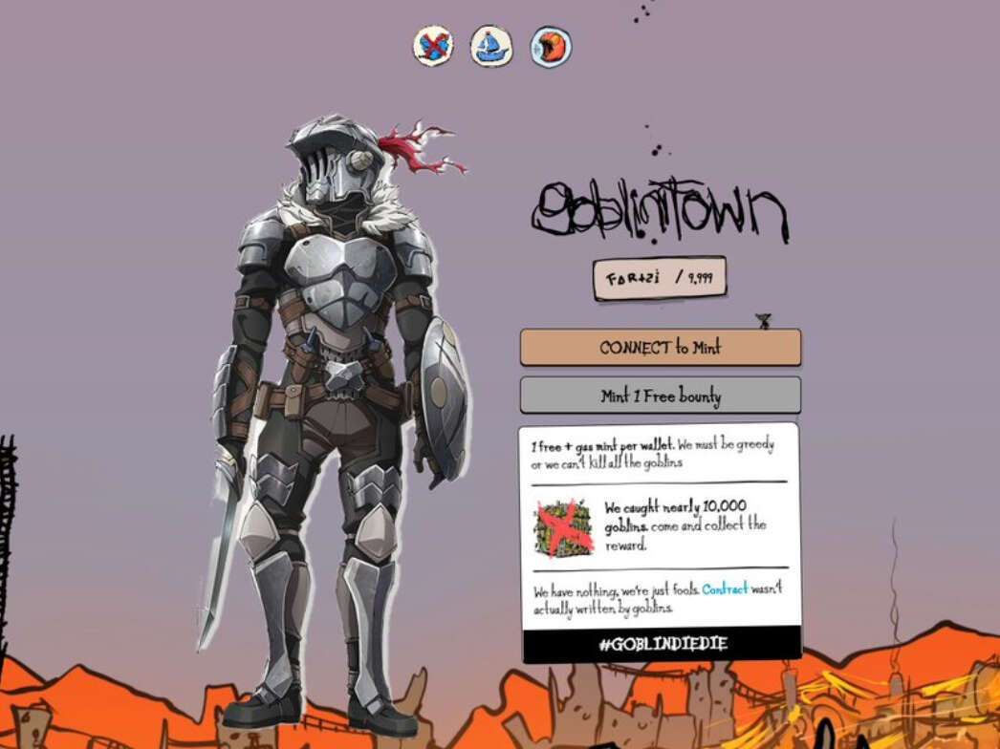

# goblinslayer

goblinslayer 是一个 NFT（Non-fungible token）集合。存储在区块链上的数字艺术品集合。总共有 10,000 个哥布林杀手 NFT。目前，4,677 位所有者的钱包中至少有一个地精杀手 NTF。售出的最昂贵的 goblinslayer NFT 是goblindiedie #5737。它于 2022 年 7 月 2 日（2 个月前）以 112.3 美元的价格售出。goblinslayer NFT 在过去 7 天内售出 1 次。哥布林杀手的总销售额为 112.35 美元。一个哥布林杀手 NFT 的平均价格为 112.3 美元。哥布林杀手拥有者 4,677 名，总供应量为 10,000 个代币。
