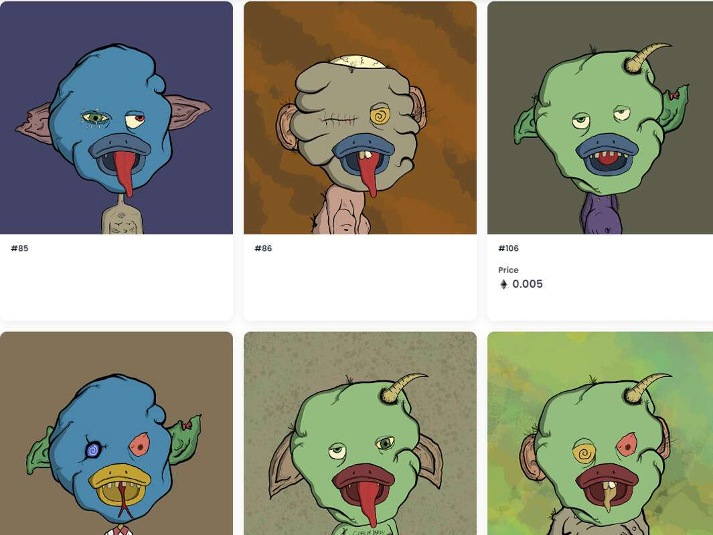

# Goblin Ducks

##### ▶ 什么是地精鸭？

Goblin Ducks 是一个 NFT（非同质代币）集合。存储在区块链上的数字艺术品集合。

##### ▶ 哥布林鸭代币有多少？

总共有 555 个 Goblin Ducks NFT。目前，272 位车主的钱包中至少有一个 Goblin Ducks NTF。

##### ▶ 最昂贵的 Goblin Ducks 销售是什么？

售出的最昂贵的 Goblin Ducks NFT 是 #101。它于 2022-06-04（3 个月前）以 12.7 美元的价格售出。

##### ▶ 最近卖出了多少只地精鸭？

过去 30 天内售出了 1 个 Goblin Ducks NFT。
