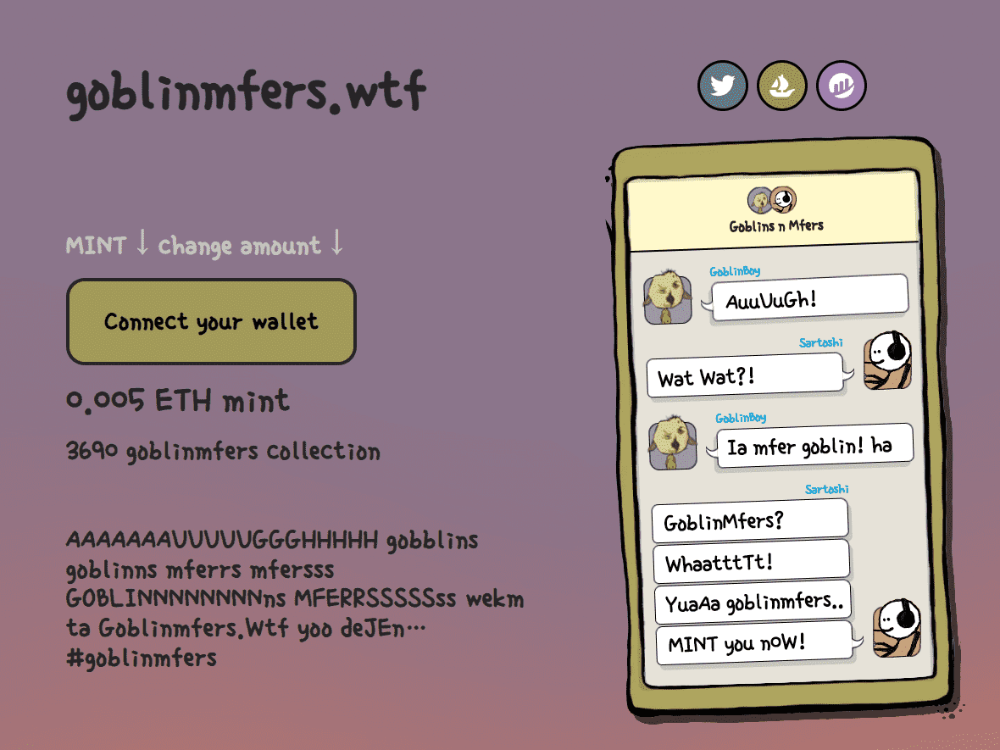

# goblinmfers.wtf

##### ▶ 什么是 goblinmfers.wtf？

goblinmfers.wtf 是一个 NFT（非同质代币）集合。存储在区块链上的数字艺术品集合。

##### ▶ 有多少个 goblinmfers.wtf 代币？

总共有 1,487 个 goblinmfers.wtf NFT。目前 292 位所有者的钱包中至少有一个 goblinmfers.wtf NTF。

##### ▶ 最昂贵的 goblinmfers.wtf 销售是什么？

售出的最昂贵的 goblinmfers.wtf NFT 是 goblinmfers #1112。它于 2022-06-08（3 个月前）以 27.1 美元的价格售出。

##### ▶ 最近卖了多少 goblinmfers.wtf？

过去 30 天内售出了 4 个 goblinmfers.wtf NFT。

