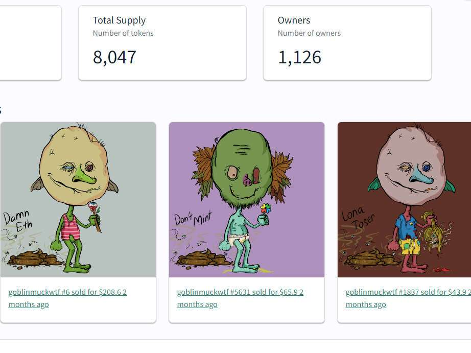

# goblinmuck.wtf

goblinmuck.wtf NFT 在过去 7 天内售出 2 次。goblinmuck.wtf 的总销售额为 1.76 美元。一个 goblinmuck.wtf NFT 的平均价格为 0.9 美元。共有 1,126 个 goblinmuck.wtf 所有者，总共拥有 8,047 个代币。

##### ▶ 什么是 goblinmuck.wtf？

goblinmuck.wtf 是一个 NFT（Non-fungible token）集合。存储在区块链上的数字艺术品集合。

##### ▶ 有多少个 goblinmuck.wtf 代币？

总共有 8,047 个 goblinmuck.wtf NFT。目前，1,126 位所有者的钱包中至少有一个 goblinmuck.wtf NTF。

##### ▶ goblinmuck.wtf 最昂贵的交易是什么？

售出的最昂贵的 goblinmuck.wtf NFT 是 goblinmuckwtf #6。它于 2022 年 6 月 20 日（2 个月前）以 208.6 美元的价格售出。

##### ▶ 最近卖了多少 goblinmuck.wtf？

过去 30 天内售出了 29 个 goblinmuck.wtf NFT。

##### ▶ goblinmuck.wtf 需要多少钱？

过去 30 天，最便宜的 goblinmuck.wtf NFT 销售额低于 1 美元，最高销售额超过 1274 美元。goblinmuck.wtf NFT 在过去 30 天内的中位价格为 4 美元。

