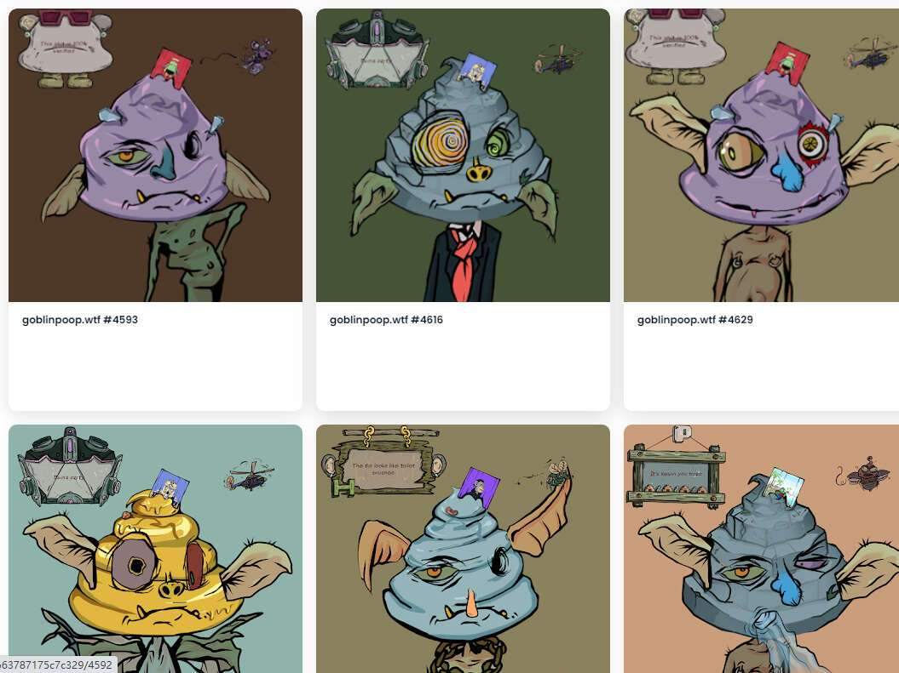

# Goblin :poop: WTF?

你拉屎，我拉屎。我们一起大便世界。我们保留 100 个 NFT 是因为我们想在全世界大便，仅此而已。每 5 个 NFT 将获得 1 次抽奖 5 ETH，每 30 个 NFT 将获得 1 次抽奖 Goblintown NFT。

##### ▶ 什么是地精 :poop: WTF??

地精 :poop: WTF？是一个 NFT（不可替代代币）集合。存储在区块链上的数字艺术品集合。

##### ▶ 多少妖精 :poop: WTF？代币存在吗？

总共有 8,888 个地精 :poop: WTF？NFT。目前 542 位拥有者至少拥有一只妖精 :poop: WTF？NTF 在他们的钱包里。

##### ▶ 最贵的妖精是什么 :poop: WTF？销售？

最贵的妖精 :poop: WTF？出售的 NFT 是 goblinpoop.wtf #763。它于 2022-06-08（3 个月前）以 9.1 美元的价格售出。

##### ▶ 多少妖精 :poop: WTF？最近有卖吗？

有 47 个地精 :poop: WTF？过去 30 天内售出的 NFT。

##### ▶ 一个地精 :poop: WTF 多少钱？成本？

在过去的 30 天里，最便宜的妖精 :poop: WTF？NFT 销售额低于 2 美元，最高销售额超过 5 美元。地精的中位数价格 :poop: WTF？NFT 在过去 30 天内为 3 美元。

