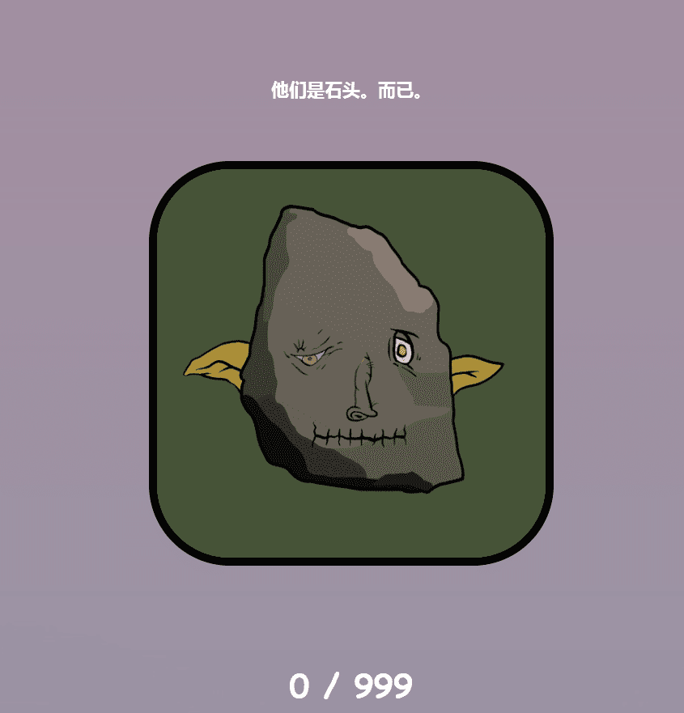

# Goblin Rocks

 什么是地精岩石？
Goblin Rocks 是一个 NFT（非同质代币）集合。存储在区块链上的数字艺术品集合。

Goblin Rocks 代币有多少？
总共有 999 个 Goblin Rocks NFT。目前 467 位车主的钱包中至少有一个 Goblin Rocks NTF。

哥布林石最近卖出了多少？
过去 30 天内售出了 1,239 个 Goblin Rocks NFT。

