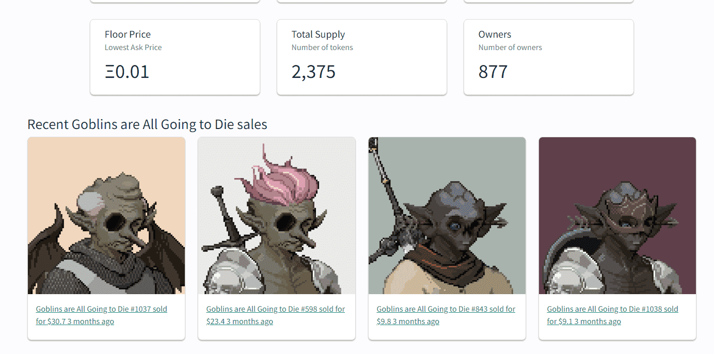

# Goblins are All Going to Die

Goblins are All Going to Die NFT 在过去 7 天被售出 1 次。Goblins are All Going to Die 的总销量为 0.11 美元。一个 Goblins are All Going to Die NFT 的平均价格为 0.1 美元。共有 877 名 Goblins are All Going to Die 所有者，总共拥有 2,375 个代币。

Goblins are All Going to Die 是一个 NFT（不可替代令牌）集合。存储在区块链上的数字艺术品集合。

##### ▶ 存在多少个 Goblins are All Going To Die 代币？

总共有 2,375 个 Goblins 即将死去 NFT。目前 877 位所有者的钱包中至少有一个 Goblins are All Going to Die NTF。

##### ▶ 什么是最昂贵的 Goblins are All Go to Die 特卖？

出售的最昂贵的 Goblins are All Going to Die NFT 是 Goblins are All Going to Die #1037。它于 2022-06-06（3 个月前）以 30.7 美元的价格售出。

