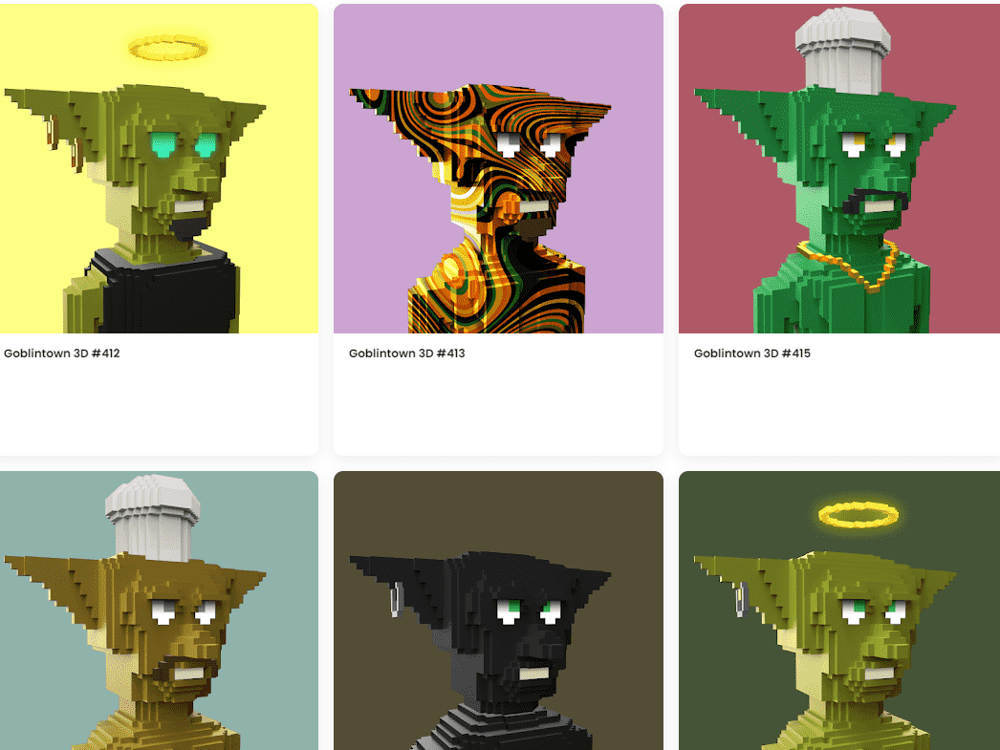

# Goblintown 3D

##### ▶ 什么是哥布林镇 3D？

Goblintown 3D 是一个 NFT（非同质代币）集合。存储在区块链上的数字艺术品集合。

##### ▶ 有多少个 Goblintown 3D 代币？

总共有 8,888 个 Goblintown 3D NFT。目前 577 位车主的钱包中至少有一个 Goblintown 3D NTF。

##### ▶ 最近卖出了多少 Goblintown 3D？

过去 30 天内售出 0 个 Goblintown 3D NFT。

##### ▶ 有哪些流行的 Goblintown 3D 替代品？

许多拥有 Goblintown 3D NFT 的用户还拥有 MINZUKI V2、 Ogre town WTF。

