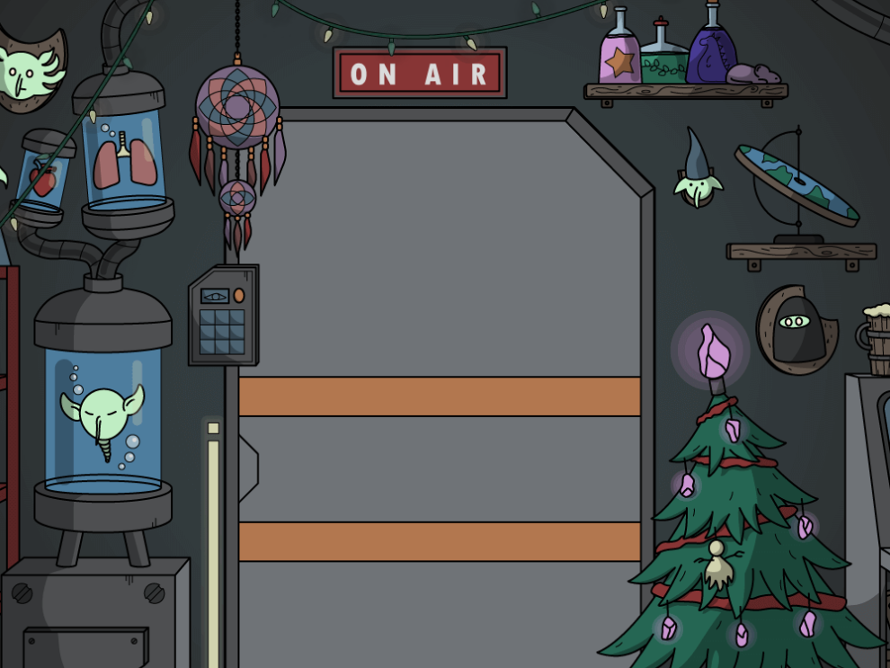

# GobzNFT

GobzNFT是从1.999个手绘字符图形随机生成的NFT的集合。在100亿个可能性中，只有1.999个GOBZ集合将被生成。它旨在围绕一个具有自己风格和未来计划的可持续项目创建社区和品牌。

他们住在里德尔星系的陨石上。因为他们误解了地球发出的信息，他们认为人类的时尚意识正在衰退。他们把它当作生死攸关的事情，决定改变一切。他们将征服世界！别担心，只是他们的风格。

$GOB代币

任何持有Gobz的人，包括Gobz子项目和主要项目，每天都能生成一定数量的$GOB代币，相当于他们持有的Gobz。除了$GOB代币将提供的伟大创新之外，它还旨在建立一个稳固的代币经济。

