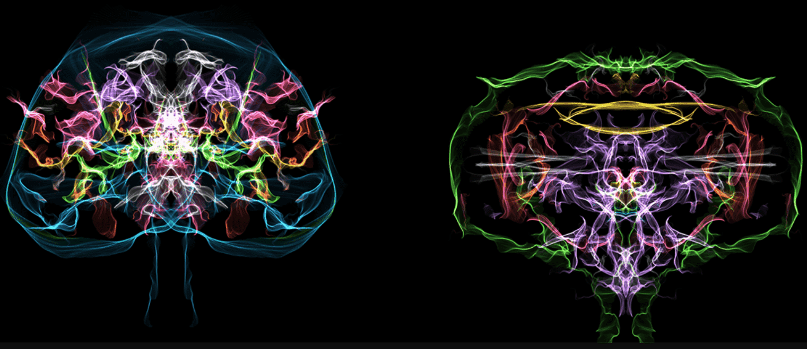

# God In The Brain

几乎所有的人体成分都是一样的。但我们的感受和思考方式因人而异。这是因为我相信我们每个人都有一个像烟一样燃烧的上帝。我相信上帝会根据谁看到它来改变它的形式。你觉得它是什么样的？

▶ 什么是大脑中的上帝？
God In The Brain 是一个 NFT（不可替代代币）集合。存储在区块链上的数字艺术品集合。
▶ 大脑中的上帝代币有多少？
总共有 21 个 God In The Brain NFT。目前，16 位所有者的钱包中至少有一个 God In The Brain NTF。

