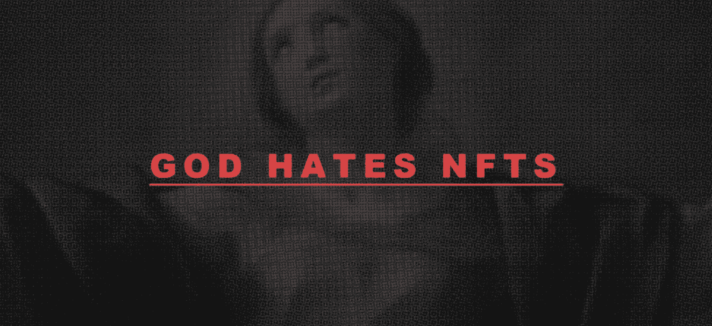

# God Hates NFTs Official

1111 个抗议标志是你救赎之路的开始，没有不和谐，没有路线图，CC0。

▶ 什么是神恨 NFT 的官员？
God Hates NFTs Official 是一个 NFT（Non-fungible token）集合。存储在区块链上的数字艺术品集合。

▶ 神恨 NFT 官方代币有多少？
总共有 1,110 个 God Hates NFT 官方 NFT。目前 527 位所有者的钱包中至少有一个 God Hates NFTs Official NTF。

▶ 最昂贵的 God Hates NFTs 官方销售是什么？
最昂贵的 God Hates NFTs Official NFT 出售的是 . 它于 2022 年 6 月 26 日（2 个月前）以 87.8 美元的价格售出。
▶ 神恨 NFT 官方最近卖出了多少？

在过去的 30 天里，有 702 个 God Hates NFTs 官方 NFTs 被售出。

