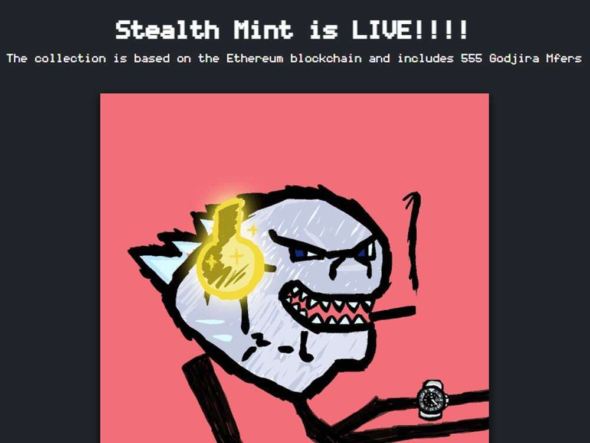

# Godjira Mfers

Godjira Mfers 于 2022 年 3 月 12 日首次铸造。我们是最后的融合！Godjira 由 sarjira 设计。Godjira mfers 是一个 1,111 个单元的系列，其灵感来自 sartoshi 本人和 Project Godjira 的坏蛋社区。该系列包含超过 69 个独特的手绘特征，涵盖各种稀有物品，没有两个相同，9 个非常特别的。

我们目前正在追踪流通中的 559 个尚未被销毁或质押的 Godjira Mfers 代币。购买 Godjira Mfers 的最常见地点包括 OpenSea 和 LooksRare 等市场或 Gem.xyz 和 Genie.xyz 等聚合器。链接可以在上面找到！
