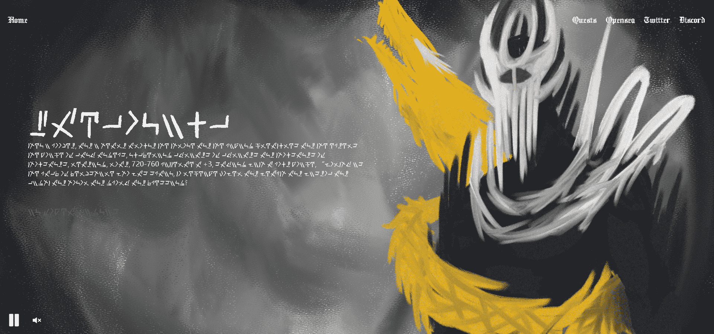

# GODLY LEGION

▶ 什么是神圣军团？
GODLY LEGION 是一个 NFT（非同质代币）集合。存储在区块链上的数字艺术品集合。

▶ 有多少 GODLY LEGION 代币？
总共有 7,777 个 GODLY LEGION NFT。目前，3,203 位所有者的钱包中至少有一个 GODLY LEGION NTF。

▶ 最昂贵的 GODLY LEGION 销售是什么？
最昂贵的 GODLY LEGION NFT 是 LEGION #2599。它于 2022 年 6 月 9 日（3 个月前）以 320 美元的价格售出。

▶ 最近卖出了多少GODLY LEGION？
过去 30 天内售出了 11,151 个 GODLY LEGION NFT。

▶ 一个神圣的军团要多少钱？
过去 30 天，GODLY LEGION NFT 最便宜的销售额低于 29 美元，最高销售额超过 217 美元。过去 30 天内，GODLY LEGION NFT 的中位价格为 124 美元。

