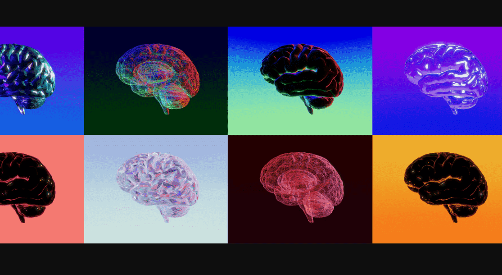

# GodMode by FlipsideCrypto

GodMode 是 Flipside Crypto 的 1,000 个社区生成的 NFT 的集合。

▶ FlipsideCrypto 的 GodMode 是什么？
FlipsideCrypto 的 GodMode 是一个 NFT（不可替代令牌）集合。存储在区块链上的数字艺术品集合。

▶ FlipsideCrypto 代币有多少 GodMode？
FlipsideCrypto NFT 总共有 1,000 个 GodMode。目前，644 位所有者的钱包中至少有一个 FlipsideCrypto NTF 的 GodMode。

▶ FlipsideCrypto 销售的最昂贵的 GodMode 是什么？
FlipsideCrypto NFT 出售的最昂贵的 GodMode 是 #10。它于 2022 年 6 月 8 日（3 个月前）以 3.6 万美元的价格售出。

▶ FlipsideCrypto 的 GodMode 最近卖出了多少？
在过去 30 天内，FlipsideCrypto NFT 售出 486 个 GodMode。

