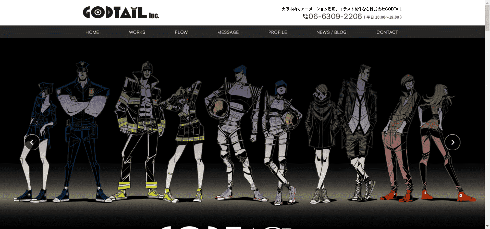

# GODTAIL

关于共创 NFT

共创 NFT 是一个总称，内容持有者和创作者通过 NFT 与粉丝连接，形成新的创作。我们相信，不仅创作本身，创作过程也能为买家和粉丝提供全新的体验。

关于GODTAIL

GODTAIL 是 GODTAIL Inc. 的总裁。他们毕业于大阪艺术大学，获得视觉艺术学位，从事该行业超过 20 年。他们参与了从广告、海报、角色设计到视频制作的广泛项目。

