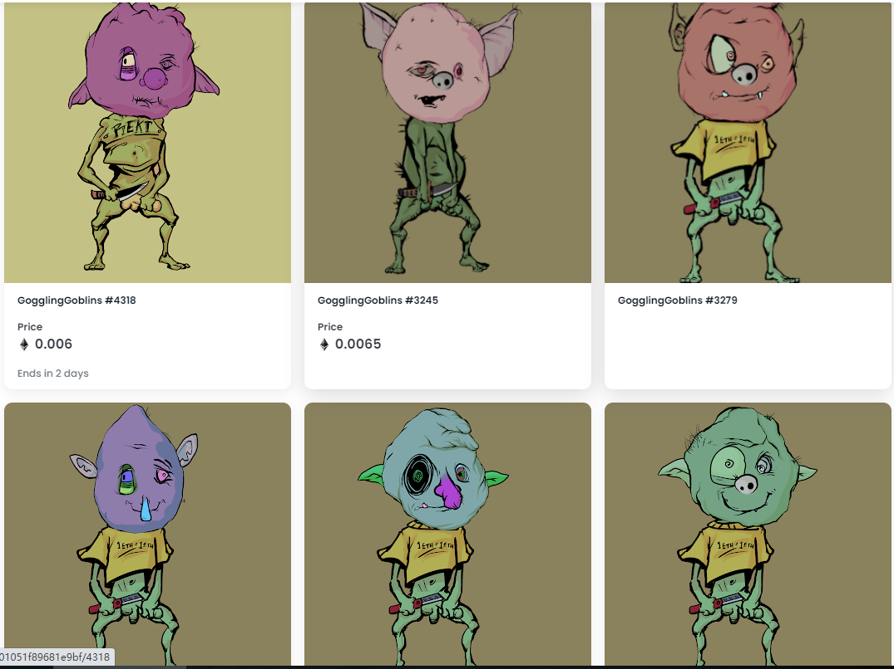

# GogglingGoblins V2

GogglingGoblins V2 于 2022 年 6 月 3 日首次发行。我们目前正在追踪 6,262 个尚未被销毁或质押的流通中的 GogglingGoblins V2 代币。我们为 GogglingGoblins V2 索引了 638 个独特的特征对。购买 GogglingGoblins V2 最常见的地方包括 OpenSea 和 LooksRare 等市场或 Gem.xyz 和 Genie.xyz 等聚合器。链接可以在上面找到！

GogglingGoblins V2的当前销售楼层为**Ξ 0.001**。我们的销售楼层基于最近的销售，已删除异常值。在过去的 24 小时内，我们没有看到 GogglingGoblins V2 的任何销售，请稍后再回来查看！

迄今为止，我们在 OpenSea、LooksRare、Gem.xyz 和 Genie 上为 GogglingGoblins V2的总共63笔销售编制了索引。

迄今为止，我们已经在 OpenSea、LooksRare、Gem.xyz 和 Genie 中为 GogglingGoblins V2的总Ξ 0.44卷建立了索引。

基于Ξ 0.001的底价和6,262**的流通供应量，我们估计 GogglingGoblins V2 的市值为 9,377**美元**，Eth 价格**为 1,664 美元。

