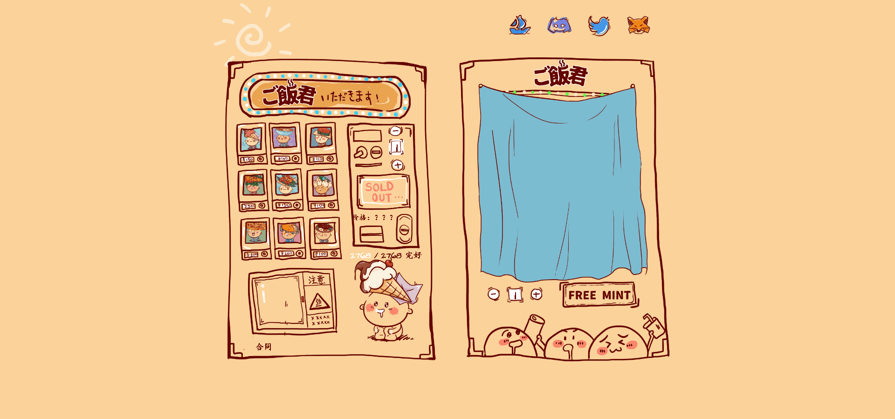

# Gohan-kun

▶ 什么是悟饭君？
Gohan-kun 是一个 NFT（Non-fungible token）集合。存储在区块链上的数字艺术品集合。

▶ 悟饭君代币有多少？
总共有 2,768 个 Gohan-kun NFT。目前，1,075 位车主的钱包中至少有一个 Gohan-kun NTF。

▶ 最昂贵的悟饭君拍卖会是什么？
卖得最贵的悟饭君 NFT 是 ご饭君GOHAN #1191。它于 2022-06-07（3 个月前）以 272.1 美元的价格售出。

▶ 最近卖了多少悟饭君？
过去 30 天内售出了 696 个 Gohan-kun NFT。

