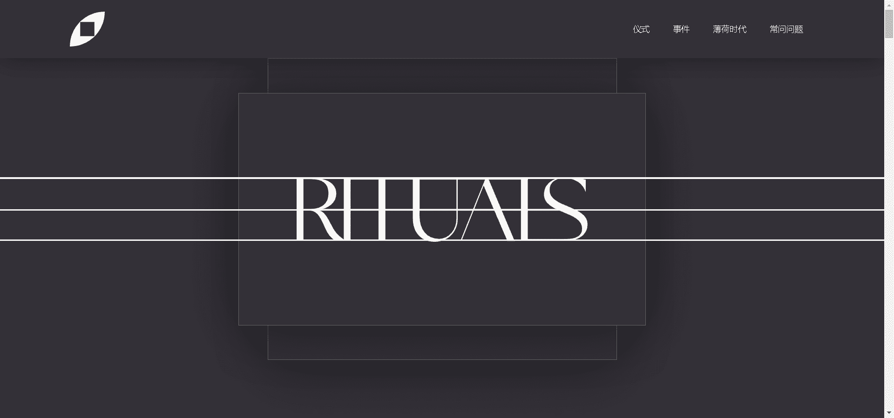

# Golden Token Rituals Venice

RITUALS 是由 Aaron Penne 和 Boreta 发起的一个音乐和艺术创作项目，旨在庆祝出现、正念和社区。这个 Art Blocks Factory 项目通过在加利福尼亚州威尼斯的 Bright Moments 画廊亲自展示和铸造前 200 件作品，将收藏家与创作的那一刻联系在一起。

您只能铸造一次，并且必须在 2021 年 9 月 24 日至 9 月 26 日周末的指定铸造时间内亲自解锁 RITUALS NFT。

拥有黄金代币：Rituals Venice (GTRV) NFT 为您提供在本周末活动期间铸造 RITUALS NFT 的权利。在 2021 年 9 月 26 日之后，GTRV 代币不可兑换为 RITUALS NFT。

