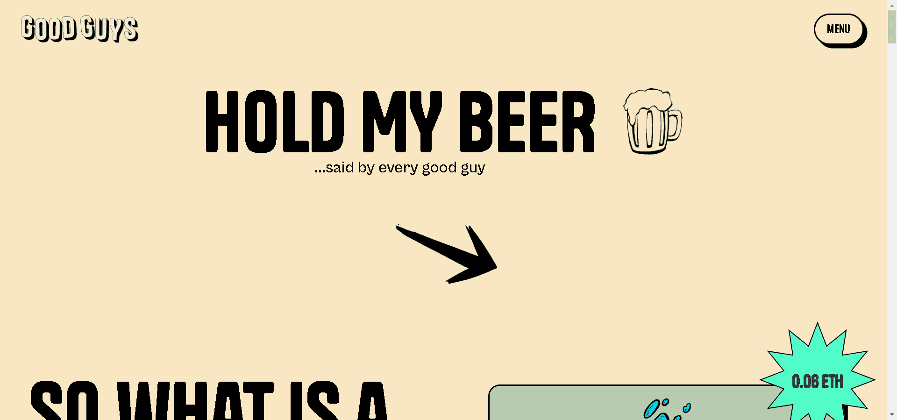

# Good Guys NFT

这是生活在洛斯拉托斯的 10,000 名好人的故事 - 曾经是一个充满活力的艺术社区，现在最好被描述为永无止境的宿醉。当 BODEGA “Art & Comics” 几年前关闭时，情况变得更糟，但幸运的是，对于 GOOD GUYS 来说，有人正在重新开放它。

在以太坊区块链 (ERC-721) 上过着最美好的生活的 10,000 个热爱啤酒的好人之一——我们打赌你以前从未听说过这个。每个人都是独一无二的，除了看起来像长达十年的宿醉外，还可以让您进入 Bodega（一种穷人的艺术街区）。
‍ 那么

