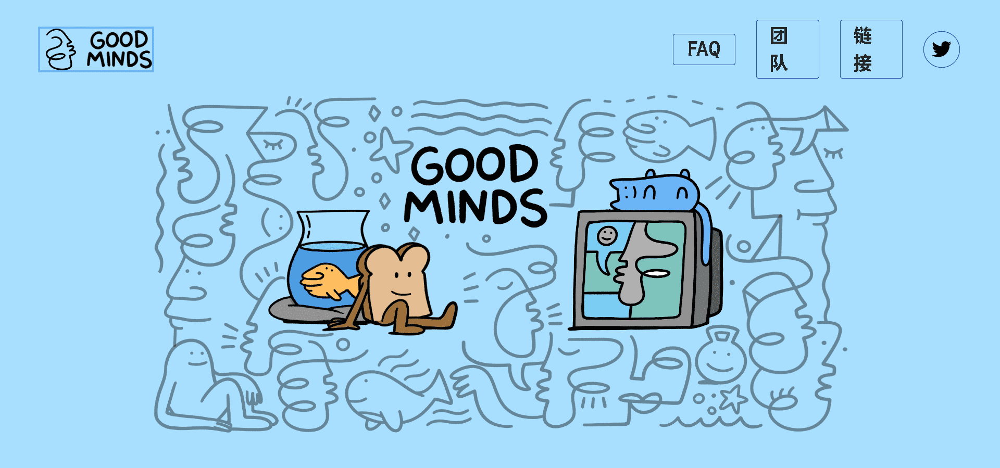

# Good Minds NFT

Good Minds 是一个独立的、以艺术为中心的 NFT 合集，拥有多个角色。以太坊区块链上共有 6000 个随机生成和精心策划的输出。

我们的稀有度排名可以在PopRank上查看。除了基于稀缺性的排名，PopRank 还提供由社区众包的审美排名。简而言之，任何人都可以玩一个游戏，在一对一的比赛中选择他们喜欢的 NFT，结果有助于我们收藏的历史美学排名。要详细了解我们选择使用 PopRank 的原因，请阅读这篇文章。

