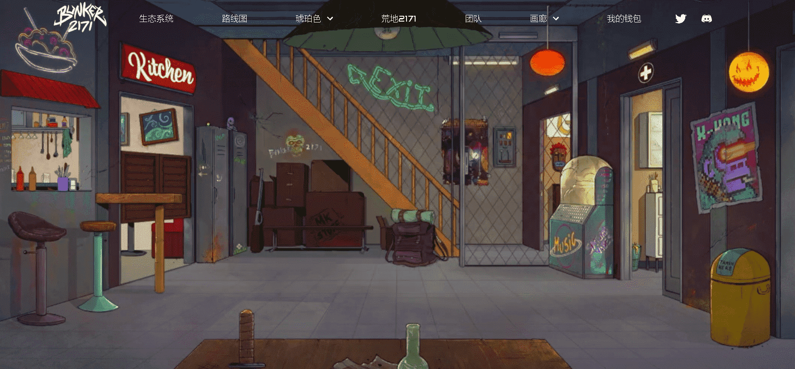

# Gorilla Nemesis

Gorilla Nemesis 是以太坊区块链上 5000 个独特的 ERC-721 NFT 的集合。

每只 Gorilla 也是您加入 Bunker 2171 会员的通行证，享有中长期会员专属福利。

Bunker 2171 的 6 个系列中的第 2 个

Bunker2171Labs 展示了一系列六个相互关联的 NFT 集合，这些集合使引人入胜的 Play-&-Earn 游戏元素能够完全解开 Bunker 2171 宇宙的奥秘。荒原 2171 是一款免费 2 人生存开放世界角色扮演游戏，具有 Play & Earn 机制，目前正在沙盒游戏中开发，预定发布日期为 2022 年。

