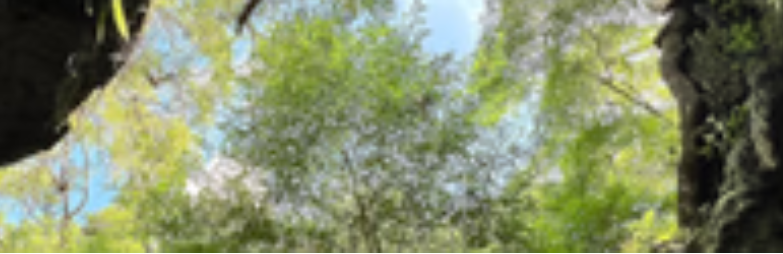

# gotoplanb's SINKHOLES

天坑让我着迷，因为它是地质学和生物学之间的交叉点，是缓慢变化和狂热适应之间的交叉点。 地球让路。 剩余的空白暴露了通过化石记录显示的数千年的自然历史。 在那个空旷的动植物竞赛中，无论该空间是潮湿还是干燥，都在竞相填补空白。

tl; dr 使用 Sinkholes，我想为数码相框创建自然内容。 您可以购买代币来获得免费空投和获得保留的折扣销售。

建立一个小型但敬业的支持者群体，他们将照片视为艺术，但也被激励与他人分享。

铸造 81 个代币，因为有 81 种不同类型的喀斯特地貌。 大多数喀斯特是天坑，但不是全部。 认为这是一个很好的数字。

提供 40 个保留列表注册，可选择 1 或 2 个令牌，每个 0.035 ETH。 5% 的创作者费用。

未预留的代币将以 0.05 ETH 的价格公开上市。

每个月我都会向每个代币持有者空投一个新的 NFT。 每个月都会来自不同的天坑。 我会向持有者抛出一些选项，让他们选择。 我还可以提供一些不同的作物和色调。 如果人们需要的话，可能会有一些很酷的变体可以用作横幅图像。

