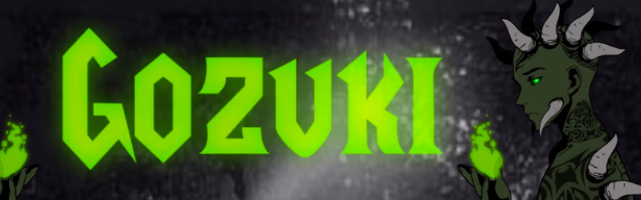

# Gozuki

进入五月的森林，那里的一切都由绿色植物组成。前期的战斗从 4444 Gozuki 开始，他们都渴望开始传承。他们都有继承王位的计划。

想想兽人、小妖精、地精、沼泽生物、爬行动物和夜行者，基本上所有生活在隐藏的迷雾中的东西。

Gozuki 颜色从兽人绿色到山灰色不等。每个人都有自己的故事和战斗。除此之外，五月的使用旧盔甲的堕落战士，渔民和农民试图进入森林，但根本没有准备好迎接他们即将遇到的事情。

以太坊在森林中是严格禁止的，但一些 Gozuki 根本不在乎.. 由于以太坊拥有黑暗势力，他们也被远离森林。

还有11 1/1 Gozuki分散在森林中。特别是有 1 个 Gozuki，身高 7 英尺，传说没有人直视他的眼睛超过 5 秒。

