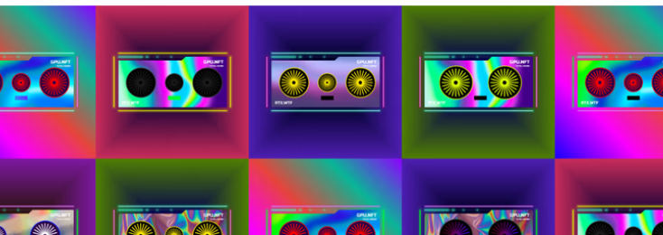

# GPU SOLDIER

GPU SOLDIER NFT - 常见问题（FAQ）
▶ 什么是 GPU 士兵？
GPU SOLDIER 是一个 NFT（Non-fungible token）集合。存储在区块链上的数字艺术品集合。
▶ 有多少 GPU SOLDIER 代币？
总共有 10,000 个 GPU SOLDIER NFT。目前 910 拥有者的钱包中至少有一个 GPU SOLDIER NTF。
▶ 最昂贵的 GPU SOLDIER 销售是什么？
售出的最昂贵的 GPU SOLDIER NFT 是 GPU SOLDIER #558。它于 2022-07-01（大约 2 个月前）以 12.1 美元的价格售出。
▶ 最近卖出了多少 GPU SOLDIER？
过去 30 天内售出了 86 个 GPU SOLDIER NFT。
▶ GPU SOLDIER 的价格是多少？
过去 30 天，最便宜的 GPU SOLDIER NFT 销售额低于 1 美元，最高销售额超过 8 美元。GPU SOLDIER NFT 在过去 30 天内的中位价格为 4 美元。
▶ 什么是流行的 GPU SOLDIER 替代品？
许多拥有 GPU SOLDIER NFT 的用户还拥有 Rubbish Trash、 Genesis Dog、 QuanneirenNFT Official和 RubbishBeast。

由 GPU SOLDIER 创建的是 10,000 个独特的显卡 NFT 的集合。我们的愿景是让每个人都能获得良好的技术条件。

