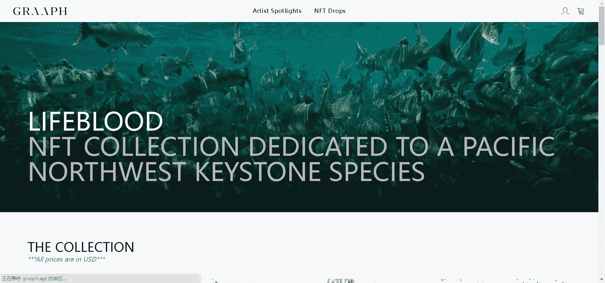

# GRAAPH x Jeremy Koreski - Lifeblood

介绍 Lifeblood，Jeremy Koreski 的第一个混合媒体产品，以及他在 GRAAPH 上的第一个 NFT 版本。

Lifeblood 是加拿大著名摄影师 Jeremy Koreski 的限量版 NFT + 打印系列。杰里米希望通过这个系列就如何更好地保护我们在西海岸都崇敬的这个物种免于灭绝这一问题展开对话。

带框的 Lifeblood 印刷品将提供给在初始掉落期间获得了 Lifeblood NFT 之一的随机选择的收藏家。这些精美的框架作品由杰里米编号和签名，其他地方没有。

