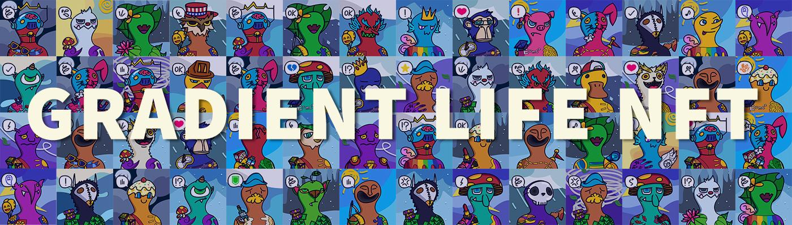

# Gradient Life NFT

555 Gradies 描绘了你在 Gradiverse 中的真实自我。

Gradient Life NFT NFT - 常见问题（FAQ）
▶ 什么是梯度生命 NFT？
Gradient Life NFT 是一个 NFT（Non-fungible token）集合。存储在区块链上的数字艺术品集合。
▶ Gradient Life NFT 代币有多少？
总共有 555 个 Gradient Life NFT NFT。目前 118 位所有者的钱包中至少有一个 Gradient Life NFT NTF。
▶ 最近卖出了多少 Gradient Life NFT？
过去 30 天内售出 0 个 Gradient Life NFT NFT。
▶ 有哪些流行的 Gradient Life NFT 替代品？
许多拥有 Gradient Life NFT NFT 的用户还拥有 EL NUMEROS、 DegenOkayBears、 WaterBe4nZuki和 Old Legacy。

