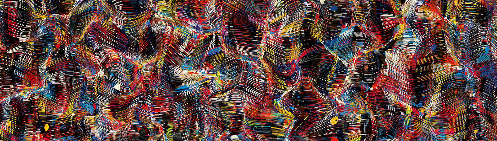

# Grailer

Grailers 是代表 GrailersDAO 成员的 999 个 NFT 的集合，GrailersDAO 是一个支持生成艺术家和更广泛的生成艺术生态系统的收集社区。每个代币也是Stefano Contiero 创作的独特艺术品。

Grailers NFT - 常见问题（FAQ）
▶ 什么是 Grailers？
Grailers 是一个 NFT（不可替代代币）集合。存储在区块链上的数字艺术品集合。
▶ 有多少 Grailers 代币？
总共有 559 个 Grailers NFT。目前，323 位所有者的钱包中至少有一个 Grailers NTF。
▶ 最昂贵的 Grailers 销售是什么？
售出的最昂贵的 Grailers NFT 是 Grailer #173。它于 2022 年 6 月 16 日（2 个月前）以 170 美元的价格售出。
▶ 最近卖出了多少 Grailers？
过去 30 天内售出了 10 个 Grailers NFT。
▶ 什么是流行的 Grailers 替代品？
许多拥有 Grailers NFT 的用户还拥有 Radix 的Eccentrics 、 Radix的 Eccentrics 2: Orbits、 Sarah Ridgley 的 Himinn和 Ben Snell 的 Cattleya。

