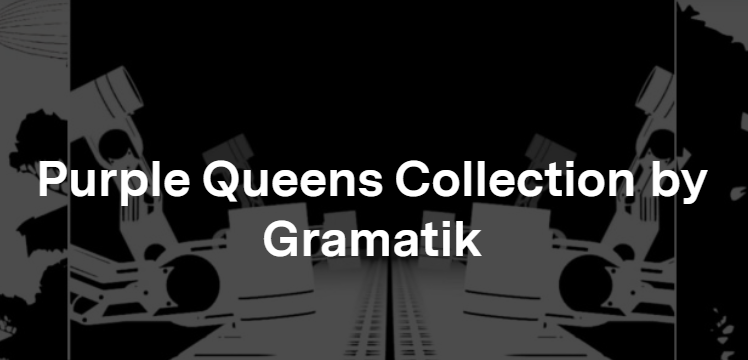

# Gramatik

Gramatik，真名 Denis Jašarević，已免费发行了 13 张专辑、4 张 EP、众多原创乐谱、单曲和混音。2013年，他成立了自己的唱片公司Lowtemp，让他进一步实现了音乐是一种自由媒体的理念。在与他的音乐共享文件的悠久历史之后，Gramatik 与 BitTorrent 合作发行了他的整个唱片。Gramatik 一直是区块链技术的长期支持者，在过去十年中参与了众多加密项目，并将自己确立为区块链有可能彻底改变音乐产业和艺术家-粉丝关系的主要倡导者。

