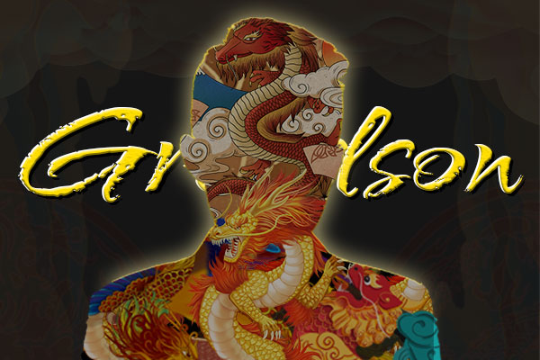

# GrandsonNFT

孙子是一个 MEME 社区和 NFT 农业项目，涉及一个有争议的人物 - 孙宇晨。可以从 whoisgrandson.com 上的农业（赌注、褶边等）获得各种 NFT。不要买$SON，感受一下！！

作为我们几个小时前推出的第一个孙子农场，我相信很多人对代币的经济性和公平性产生了怀疑，因此，我将在下面详细说明。

你可能想知道孙子是什么？所以基本上，孙子在市场上没有流通，这意味着你不能在任何交易所买卖孙子。

我从“Game-Fi”或“Game-DeFi”这个概念中得到了这个想法，我没有做任何创造性的事情，而是将其应用到 NFT 挖矿中。很少有人明白我为什么这样做，是为了确保稀缺吗？我不知道。

言归正传，就像我说的，孙子的总供应量并不重要，因为我不运行无限量化宽松之类的东西。因此，您只需要知道 $SON 质押模型和孙子与 NFT 的兑换比例。

