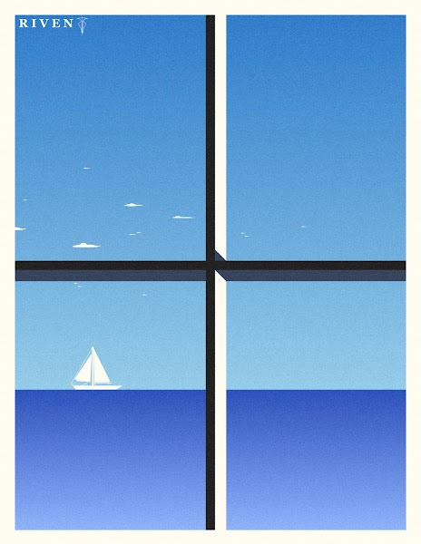

# Grant Riven Yun Early Works

《Grant Riven Yun - Early Works》是Yun在数字艺术生涯初期（2016-2017）创作的一系列作品。每件作品都是在 Microsoft PowerPoint 上使用 1 层创建的，通过使用形状工具来操纵形状以创建对象的轮廓。由于没有专用数字插图工具的选项和功能，Yun 的风格是由他使用的软件的必要性和局限性所塑造的。他今天的风格融合了本系列中使用的许多相同技术。

Grant Riven Yun 早期作品 NFT - 常见问题（FAQ）
▶ 什么是Grant Riven Yun 早期作品？
Grant Riven Yun Early Works 是一个 NFT (Non-fungible token) 集合。存储在区块链上的数字艺术品集合。
▶ Grant Riven Yun Early Works 代币有多少？
总共有 7 个 Grant Riven Yun Early Works NFT。目前有 6 位业主的钱包中至少有一份 Grant Riven Yun Early Works NTF。
▶ 最近卖出了多少Grant Riven Yun早期作品？
过去 30 天共售出 0 个 Grant Riven Yun Early Works NFT。

