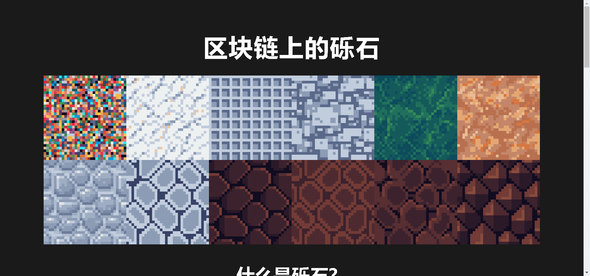

# GRAVEL

Gravel 是以太坊区块链上 2500 NFTS 的集合。每个 NFT 是 0.03 ETH。您一次最多可以铸币 30 枚。

▶ 什么是砾石？
GRAVEL 是一个 NFT（不可替代代币）集合。存储在区块链上的数字艺术品集合。

▶ 存在多少个 GRAVEL 代币？
总共有 2,500 个 GRAVEL NFT。目前，991 位所有者的钱包中至少有一个 GRAVEL NTF。

▶ 什么是最昂贵的 GRAVEL 销售？
卖出的最贵的 GRAVEL NFT 是 476。它于 2022-08-30（3 天前）以 35.2 美元的价格售出。

▶ 最近卖出了多少 GRAVEL？
过去 30 天内售出了 9 个 GRAVEL NFT。

