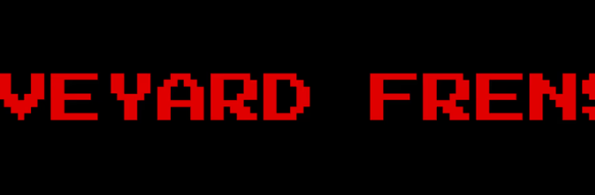

# Graveyard Frens

墓地狂热者
Graveyard Frens 是生活在以太坊区块链上的 1111 个随机生成的收藏品的集合。帮助僵尸从邪恶的科学家手中逃脱，作为回报，僵尸将以 $GRAVE 奖励您。1 美元墓地 = 1 美元墓地。每个僵尸都是独一无二的，其中一些具有额外的稀有特征。加入社会

8 月 25 日的快照！(08/25/22) 按住 5 即可获得解毒剂！

Graveyard Frens 是生活在 ETH 区块链上的 1111 个僵尸的集合。你能帮助火炬手捕获所有的僵尸吗？

