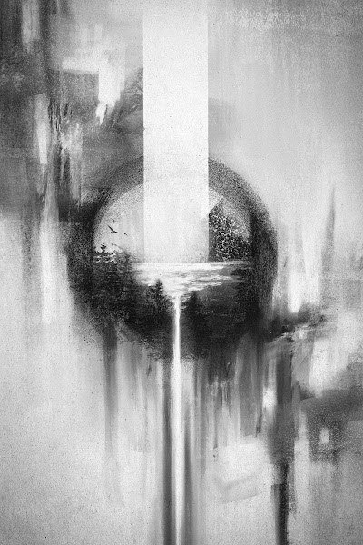

# GRAY ART EDITIONS

Samuel Gray 的版本 NFT 艺术品。

在 2022 年 4 月部署的 Manifold 自定义智能合约上作为 ERC1155 代币铸造。

GREY ART EDITIONS NFT - 常见问题（FAQ）
▶ 什么是 GREY ART EDITIONS？
GREY ART EDITIONS 是一个 NFT（不可替代令牌）集合。存储在区块链上的数字艺术品集合。
▶ 有多少 GREY ART EDITIONS 代币？
总共有 1 个 GREY ART EDITIONS NFT。目前，26 位车主的钱包中至少有一个 GREY ART EDITIONS NTF。
▶ 最近卖出了多少 GREY ART EDITIONS？
过去 30 天内共售出 0 个 GREY ART EDITIONS NFT。
▶ 什么是流行的 GREY ART EDITIONS 替代品？
许多拥有 GREY ART EDITIONS NFT 的用户还拥有 Circling Thoughts、 Touching Sensations、 AGYAAT LIMITED EDITIONS和 Monster Bricks。

