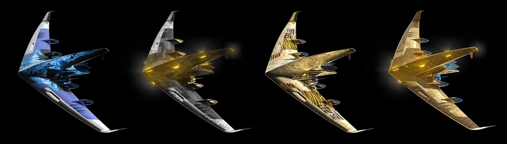

# GRAYCRAFT Collaborations

GRAYCRAFT 协作统计  创建于 11 个月前   2 代币供应  5% 费用
过去 7 天内没有售出 GRAYCRAFT Collaborations。

空间体验是一种被分享的特权。发现与我们最喜欢的一些项目的合作。保持好奇。

GRAYCRAFT 合作 NFT - 常见问题 (FAQ)
▶ 什么是 GRAYCRAFT 合作？
GRAYCRAFT Collaborations 是一个 NFT（非同质代币）集合。存储在区块链上的数字艺术品集合。
▶ 存在多少 GRAYCRAFT Collaborations 代币？
总共有 2 个 GRAYCRAFT Collaborations NFT。目前，149 位所有者的钱包中至少有一个 GRAYCRAFT Collaborations NTF。
▶ 最近卖出了多少 GRAYCRAFT Collaborations？
过去 30 天内售出 0 个 GRAYCRAFT Collaborations NFT。

