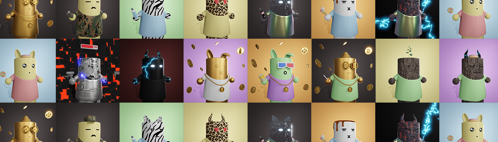

# GRD KRICE

🎂 krice 是 grdswap 的完结的 的 是 是 是 是 是 是 的 一一一一 一一一一 庞庞庞庞。 🎂 Krys 项目是 GRDSWAP 的一个完全随机的 3D NFT PFP 项目。这是 GRDSWAP 的一个新项目，旨在建立一个庞大的社区。我们一起适应和响应巨大的变化即将到来，带来更大的财富和财富。建立一个社区。

推出 Garaetteok NFT

Garaetteok NFT 今天发布。
Garaetteok NFT 的名称是 KRICE，由持有者投票决定。

Garaetteok NFT的具体内容如下。

名称：GRD KRICE
符号：KRICE
钱包限额：无限制
每笔交易最大购买数量：5
铸币数量：10000枚中的2000枚（剩余数量将在铸币后反映持有人意见后公布）
价格：19 克莱
铸币时间：3月11日22:30
截止日期：3月12日22:30（铸币开始后24小时）
重建时间：待定

路线图变更通知

乐透系统实施与开发
使用 V1 的 SWAP 时减免 10% 的税款
进阶到其他网络（详情将另行公布）

