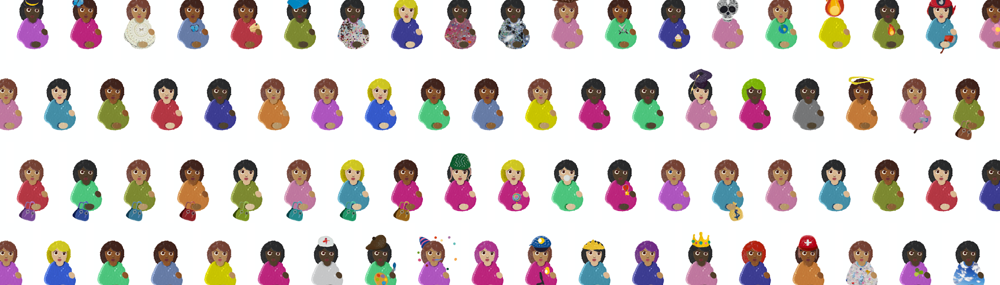

# Great Expectations

HENI 很高兴推出 The Great Expectations NFT 系列，其中包含 Damien Hirst 创作的 10,000 件独特艺术品。继他为 Drake 的专辑封面创作的艺术作品之后，NFT 展示了类似表情符号的孕妇网格，其形状由直接取自 The Currency 艺术品本身的各种形状、大小和颜色的斑点构成。NFT 被空投给 Damien Hirst 的第一个 NFT 系列 The Currency 的持有者。

该系列位于 Palm 区块链上，这是一个新的代币驱动生态系统，用于连接到以太坊的 NFT。它的能源效率比以太坊或比特币等工作证明系统高 99%。Great Expectations NFT 可以转移到以太坊。

