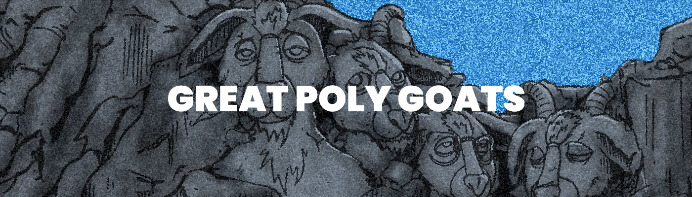

# Great Poly Goats

Great Poly Goats NFT - 常见问题（FAQ）
▶ 什么是大聚山羊？
Great Poly Goats 是一个 NFT（非同质代币）集合。存储在区块链上的数字艺术品集合。
▶ 有多少个 Great Poly Goats 代币？
总共有 1,253 个 Great Poly Goats NFT。目前，81 位业主的钱包中至少有一只 Great Poly Goats NTF。
▶ 最昂贵的 Great Poly Goats 销售是什么？
出售的最昂贵的 Great Poly Goats NFT 是 Great Poly Goats #10078。它于 2022-06-07（3 个月前）以 5.4 美元的价格售出。
▶ 最近卖出了多少只大聚山羊？
过去 30 天内共售出 7 个 Great Poly Goats NFT。

