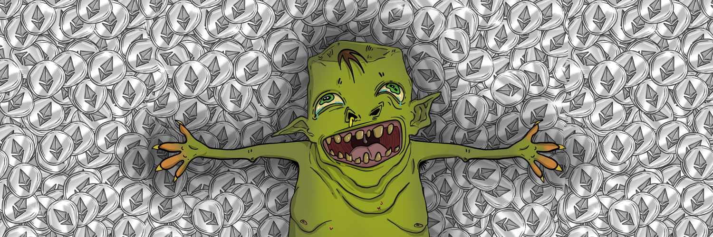

# greedygoblins.wtf

greedygoblins.wtf NFT - 常见问题（FAQ）
▶ 什么是 greedygoblins.wtf？
greedygoblins.wtf 是一个 NFT（Non-fungible token）集合。存储在区块链上的数字艺术品集合。
▶ 有多少个 greedygoblins.wtf 代币？
总共有 10,000 个 greedygoblins.wtf NFT。目前，4,714 位所有者的钱包中至少有一个 greedygoblins.wtf NTF。
▶ 最昂贵的 greedygoblins.wtf 销售是什么？
最昂贵的 greedygoblins.wtf NFT 是 Greedy Goblin #1618。它于 2022-06-06（3 个月前）以 1.5 美元的价格出售。
▶ 最近卖出了多少个greedygoblins.wtf？
过去 30 天内售出了 39 个 greedygoblins.wtf NFT。
▶ greedygoblins.wtf 需要多少钱？
过去 30 天，最便宜的 greedygoblins.wtf NFT 销售额低于 1 美元，最高销售额超过 7 美元。greedygoblins.wtf NFT 在过去 30 天内的中位价格为 2 美元。
▶ 什么是流行的 greedygoblins.wtf 替代品？
许多拥有 greedygoblins.wtf NFT 的用户也拥有 Goblin Land NFT、 goblinpisswtf、 GoblinWillDoIt.wtf和 gtburgers.wtf。

