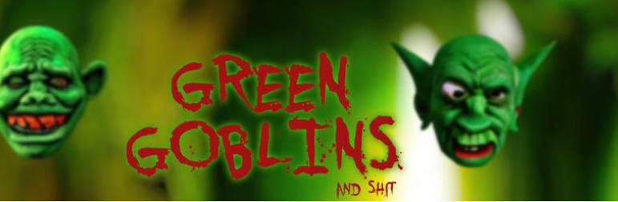

# Green Goblins And Shit

有史以来第一个 100% AI 生成具有所有者相关元数据的 PFP 和艺术收藏：当你囤积超过 10 个地精时，它们都会变成同样由 AI 制作的 Mystic Shit，所以你可能真的喜欢它。确保刷新元数据以检查地精的当前状态！

Green Goblins And Shit NFT - 常见问题（FAQ）
▶ 什么是绿魔和狗屎？
Green Goblins And Shit 是一个 NFT（不可替代代币）系列。存储在区块链上的数字艺术品集合。
▶ 有多少绿妖精和狗屎代币？
总共有 3,333 个 Green Goblins And Shit NFT。目前，1,626 位车主的钱包里至少有一个 Green Goblins And Shit NTF。
▶ 什么是最昂贵的 Green Goblins And Shit 特卖？
售出的最昂贵的 Green Goblins And Shit NFT 是 #317 Geraldo Creepycock。它于 2022-06-27（2 个月前）以 27.4 美元的价格售出。
▶ 最近卖出了多少绿妖精和狗屎？
过去 30 天内售出了 89 个 Green Goblins And Shit NFT。
▶ Green Goblins And Shit 要多少钱？
在过去 30 天里，最便宜的 Green Goblins And Shit NFT 销售额低于 2 美元，最高销售额超过 9 美元。过去 30 天，Green Goblins And Shit NFT 的中位价格为 4 美元。
▶ 什么是流行的 Green Goblins And Shit 替代品？
许多拥有 Green Goblins And Shit NFT 的用户还拥有 WagTown、 RunningGoblin、 Death of an Immortal和 0EProgrammed。

