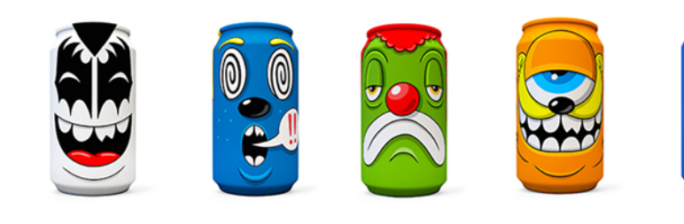

# GREG MIKE

GREG MIKE NFT - 常见问题（FAQ）
▶ 什么是 GREG MIKE？
GREG MIKE 是一个 NFT（不可替代代币）集合。存储在区块链上的数字艺术品集合。
▶ 有多少个 GREG MIKE 代币？
总共有 1,683 个 GREG MIKE NFT。目前，262 位车主的钱包中至少有一个 GREG MIKE NTF。
▶ 最昂贵的 GREG MIKE 销售是什么？
最昂贵的 GREG MIKE NFT 是 Marble Smoke (BILLELIS x GREG MIKE COLLAB)。它于 2022-08-10（17 天前）以 633.1 美元的价格售出。
▶ 最近卖出了多少 GREG MIKE？
过去 30 天内售出了 18 个 GREG MIKE NFT。
▶ GREG MIKE 需要多少钱？
在过去 30 天里，最便宜的 GREG MIKE NFT 销售额低于 194 美元，最高销售额超过 725 美元。过去 30 天 GREG MIKE NFT 的中位价格为 397 美元。
▶ 什么是流行的 GREG MIKE 替代品？
许多拥有 GREG MIKE NFT 的用户还拥有 GREG MIKE - Mad Cans (3D)、 NotLarvaLads、 ODDX和 保持去中心化。

